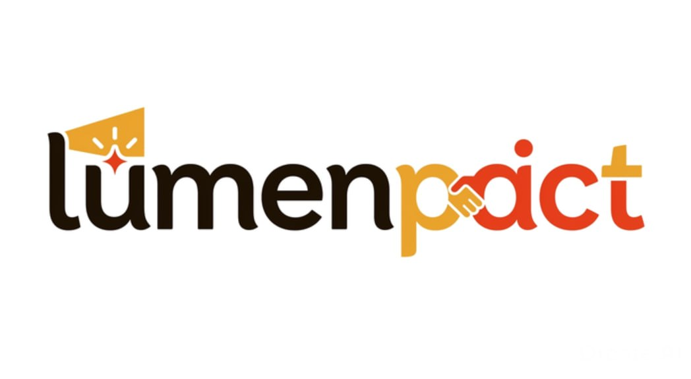

<p align="center">
  
</p>

<h1 align="center">Lumenpact</h1>

<p align="center">
  <strong>A decentralized accountability partner that actually hits your wallet if you get lazy.</strong>
</p>

<p align="center">
  <a href="https://github.com/LumenpactHQ/lumenpact/actions">
    
  </a>
  
  
  
  
</p>

---

## What is Lumenpact?

Lumenpact is a habit-staking and commitment contract platform built on Stellar. Users lock up XLM with a personal goal and a deadline. A trusted friend — the **Judge** — decides whether the goal was met. If you succeed, your stake comes back. If you fail, it goes to a penalty address you chose yourself: a friend's wallet or a burn address.

No middlemen. No excuses. Your word is on-chain.

---

## The Problem

Habit-tracking apps are free. That's exactly why they don't work.

There's no real cost to skipping the gym, missing a writing deadline, or abandoning a learning goal when the only consequence is a broken streak on an app that doesn't care. Accountability needs skin in the game — and most tools don't have any.

---

## The Solution

Lumenpact makes commitment financial. You lock real XLM, name a real person to hold you accountable, and set a real deadline. The contract enforces the outcome. The judge can't be bribed — they either call Pass or Fail, and the contract executes automatically.

```
User locks XLM → sets goal + deadline + judge + penalty address
         ↓
Deadline arrives
         ↓
Judge calls Pass → funds return to user ✅
Judge calls Fail → funds go to penalty address (friend / burn) ❌
         ↓
Judge never responds? → User can cancel after grace period → refund
```

---

## Live Demo

**Frontend:** coming soon — deploying to Vercel
**Network:** Stellar Testnet
**Contract:** `CBWJN4POFN2IDVDQOFUAKTHDE7K3GJHDXWGSG6KL6JAYZKSZROD5EMMZ`

---

## Deployed Contracts (Stellar Testnet)

| Contract | Address | Explorer |
|----------|---------|----------|
| Commitment Escrow | `CBWJN4POFN2IDVDQOFUAKTHDE7K3GJHDXWGSG6KL6JAYZKSZROD5EMMZ` | [stellar.expert](https://stellar.expert/explorer/testnet/contract/CBWJN4POFN2IDVDQOFUAKTHDE7K3GJHDXWGSG6KL6JAYZKSZROD5EMMZ) |

> **Network:** Stellar Testnet | All contracts upgradeable

---

## How It Works — Full User Flow

### Creating a Commitment

1. Connect your Stellar wallet (Freighter, xBull, or Albedo)
2. Fill in your goal description (e.g. *"I will publish a blog post by Friday"*)
3. Set a deadline (date + time)
4. Enter your Judge's Stellar wallet address
5. Choose a penalty address — a friend's wallet **or** a burn address
6. Lock your XLM stake — contract holds it until resolution
7. Share your commitment link with your Judge

### Resolving a Commitment (Judge)

1. Judge connects their wallet
2. Opens their **Judge Inbox** — a filtered view of all commitments assigned to them
3. Clicks **Pass** or **Fail** after the deadline
4. Contract executes immediately — no delays, no manual transfers

### If the Judge Goes Silent

1. After the deadline + a grace period, the user can manually trigger **Cancel & Refund**
2. Stake is returned to the user
3. Commitment is marked as **Expired — Unresolved**

---

## Architecture

```
┌─────────────────────────────────────────┐
│          Next.js 14 Frontend            │
│  (App Router · Tailwind CSS · Wallets)  │
└──────────────────┬──────────────────────┘
                   │
             Soroban RPC
                   │
   ┌───────────────▼──────────────────┐
   │      commitment_escrow           │
   │                                  │
   │  create_commitment()             │
   │  resolve()          ─────────► Pass → refund to user
   │  cancel()                        │   Fail → send to penalty_address
   │  get_commitment()                │
   │  get_user_commitments()          │
   │  get_judge_commitments()         │
   └──────────────────────────────────┘
```

### Inter-Contract Call Flow

**Create Commitment:** User calls `create_commitment(judge, amount, deadline, description, penalty_address, penalty_type)` → XLM transferred to escrow contract → commitment stored on-chain with status `ACTIVE`

**Resolve:** Judge calls `resolve(commitment_id, passed: bool)` → contract checks caller is designated judge and deadline has passed → if `passed`: XLM returned to creator → if `!passed`: XLM sent to `penalty_address` → status updated to `RESOLVED`

**Cancel:** Creator calls `cancel(commitment_id)` → contract checks deadline + grace period has elapsed and judge has not resolved → XLM returned to creator → status updated to `CANCELLED`

---

## Commitment States

```
ACTIVE → RESOLVED (pass)   — judge called Pass, stake refunded
ACTIVE → RESOLVED (fail)   — judge called Fail, stake sent to penalty
ACTIVE → CANCELLED         — grace period elapsed, user manually cancelled
```

---

## Goal Verification

This is the most important design question in a commitment platform: **how do you actually know the goal was met?**

Lumenpact approaches this in three stages across its roadmap — shipping the simplest version first and layering verifiability over time.

---

### v1 — Trusted Judge (live now)

The user nominates a person they trust as their Judge. The Judge reviews the commitment and clicks **Pass** or **Fail** after the deadline. No proof is required — it's entirely social.

```
Creator sets goal → Judge reviews → Judge clicks Pass or Fail → Contract executes
```

**Why this works for v1:**
The social pressure is the product, not cryptographic proof. If you nominate your friend, your colleague, or your partner as Judge, you're not going to lie to them — and they're not going to lie for you. The financial stake makes the conversation real even without on-chain proof.

**Known limitation:** The Judge and creator could collude. This is acknowledged and acceptable in v1 — Lumenpact is a trust-based social product, not an adversarial protocol. The financial risk is the user's own money, so the incentive to self-sabotage is low.

---

### v1.5 — Evidence Submission + Judge Review (next)

The user submits proof when marking their goal complete — a photo, a link, a screenshot, or any URL. The evidence link is stored on-chain as part of the commitment. The Judge sees the evidence in their inbox before clicking Pass or Fail.

```
Creator completes goal
         ↓
Creator submits evidence (URL / IPFS link)
         ↓
evidence_url stored on-chain in Commitment struct
         ↓
Judge opens inbox → sees goal + deadline + evidence link
         ↓
Judge clicks Pass or Fail with full context
```

**What changes in the contract:**
One new optional field on the `Commitment` struct — `evidence_url: Option<String>`. One new function — `submit_evidence(user, commitment_id, url)` — callable only by the creator, only before resolution.

**What changes in the frontend:**
A "Submit Proof" step on the creator dashboard once the deadline passes. The Judge inbox shows an evidence card (preview link) alongside the Pass/Fail buttons.

**Storage approach:** Evidence itself lives off-chain (the user pastes any public URL — a tweet, a Strava activity, a GitHub commit, a photo). Only the URL is stored on-chain, keeping contract storage minimal.

---

### v2 — Oracle-Verified Goals (roadmap)

For goals that have a verifiable external signal, an oracle can post the outcome on-chain automatically — removing the human judge entirely for those goal types.

| Goal Type | Oracle Source | Signal |
|-----------|--------------|--------|
| Run 5km this week | Strava API | activity distance + timestamp |
| Commit code every day | GitHub API | contribution graph |
| Ship a PR by Friday | GitHub API | merged PR before deadline |
| Read for 30 mins daily | Kindle / Readwise API | reading session data |

```
Off-chain oracle watches API
         ↓
Deadline passes → oracle reads signal
         ↓
Oracle posts verified result on-chain (signed)
         ↓
Contract validates oracle signature → executes Pass or Fail
```

**Why this is v2 and not v1:**
Oracle infrastructure requires a trusted off-chain verifier, signed payloads, and anti-manipulation logic. It's meaningfully more complex than the judge model and would delay shipping. The judge model covers the 80% case (personal, social goals) well enough to launch and validate demand first.

---

### Verification Model Summary

| Version | How it works | Trust model | Complexity |
|---------|-------------|------------|------------|
| **v1** | Judge clicks Pass/Fail | Social trust | ✅ Simple |
| **v1.5** | Creator submits evidence, Judge reviews | Social trust + evidence | ✅ Low |
| **v2** | Oracle reads external API, posts on-chain | Cryptographic | ⚙️ High |

---

## Smart Contract Functions

### Commitment Escrow

| Function | Description | Version |
|----------|-------------|---------|
| `create_commitment(user, judge, amount, deadline, description, penalty_address, penalty_type)` | Lock XLM, store goal, assign judge and penalty destination | v1 |
| `resolve(judge, commitment_id, passed)` | Judge calls Pass or Fail — executes transfer immediately | v1 |
| `cancel(user, commitment_id)` | Creator cancels after grace period if judge never resolved | v1 |
| `get_commitment(commitment_id)` | Read full commitment data | v1 |
| `get_user_commitments(user)` | All commitments created by a user | v1 |
| `get_judge_commitments(judge)` | All commitments assigned to a judge — powers the Judge Inbox | v1 |
| `submit_evidence(user, commitment_id, url)` | Creator submits proof URL before resolution — stored on-chain | v1.5 |

### Data Structures

```rust
pub struct Commitment {
    pub id: u64,
    pub creator: Address,
    pub judge: Address,
    pub amount: i128,
    pub deadline: u64,
    pub grace_period: u64,
    pub description: String,
    pub penalty_address: Address,
    pub penalty_type: PenaltyType,    // Friend | Burn
    pub status: CommitmentStatus,     // Active | Resolved | Cancelled
    pub outcome: Option<bool>,        // Some(true) = pass, Some(false) = fail
    pub evidence_url: Option<String>, // v1.5 — creator submits proof URL before resolution
    pub created_at: u64,
    pub resolved_at: Option<u64>,
}
```

---

## Penalty Types

| Type | What happens on Fail |
|------|----------------------|
| **Friend** | Stake sent to a wallet address the user specifies at creation |
| **Burn** | Stake sent to a provably unspendable burn address |

No charity integration in v1 — keeping it simple and social.

---

## Reward / Outcome Table

| Outcome | What happens to stake |
|---------|----------------------|
| **Pass** | Full stake returned to creator |
| **Fail** | Full stake sent to penalty address |
| **Cancelled** (judge silent) | Full stake returned to creator after grace period |

No platform fee in v1. The product is the accountability, not the cut.

---

## Tech Stack

| Layer | Technology | Version |
|-------|-----------|---------|
| **Smart Contracts** | Rust + Soroban SDK | 1.96.1 / 21.7.6 |
| **Frontend** | Next.js (App Router) | 14.x |
| **UI** | React + Tailwind CSS | 18.x / 3.4.x |
| **Language** | TypeScript | 5.x |
| **Wallet** | Stellar Wallets Kit | Freighter, xBull, Albedo |
| **Testing** | Vitest + Testing Library | latest |
| **Contract Testing** | `#[test]` + soroban-sdk testutils | — |
| **CI/CD** | GitHub Actions | Node 18/20 + Rust |
| **Deployment** | Vercel (frontend) + Stellar Testnet | — |

---

## Project Structure

```
lumenpact/
├── .github/workflows/ci.yml        # CI pipeline
├── contracts/
│   ├── Cargo.toml                   # Workspace manifest
│   └── commitment_escrow/           # Core escrow contract
│       ├── src/
│       │   ├── lib.rs               # Contract entry points
│       │   ├── types.rs             # Commitment, PenaltyType, Status
│       │   ├── storage.rs           # On-chain state helpers
│       │   └── errors.rs            # Error types
│       └── tests/                   # Contract test suite
├── frontend/
│   ├── public/                      # Logo, OG image
│   ├── src/
│   │   ├── app/                     # Next.js pages
│   │   │   ├── /                    # Landing page
│   │   │   ├── /create              # Create a commitment
│   │   │   ├── /commitment/[id]     # Commitment detail
│   │   │   ├── /dashboard           # My commitments (creator view)
│   │   │   └── /judge               # Judge inbox
│   │   ├── components/
│   │   │   ├── commitment/          # CommitmentCard, StatusBadge, Timer
│   │   │   ├── judge/               # JudgeInbox, ResolvePanel
│   │   │   ├── wallet/              # WalletConnect, WalletModal
│   │   │   └── ui/                  # Button, Input, Toast, Skeleton
│   │   ├── hooks/                   # useCommitment, useWallet, useJudge
│   │   ├── services/                # Soroban RPC service layer
│   │   ├── utils/                   # Formatting, deadline helpers
│   │   ├── config/                  # Network + contract constants
│   │   └── types/                   # TypeScript interfaces
│   └── __tests__/                   # Frontend test suites
└── README.md
```

---

## Getting Started

### Prerequisites

- **Rust** ≥ 1.85.0 with `wasm32-unknown-unknown` target
- **Node.js** ≥ 18
- **Stellar CLI** (`stellar-cli`)
- **Freighter Wallet** browser extension

### Setup

```bash
# Clone
git clone https://github.com/LumenpactHQ/lumenpact.git
cd lumenpact

# Build smart contracts
cd contracts
stellar contract build
cargo test

# Setup frontend
cd ../frontend
cp .env.local.example .env.local
# Add your deployed contract ID to .env.local

npm install
npm test
npm run dev  # http://localhost:3000
```

### Environment Variables

```bash
# frontend/.env.local
NEXT_PUBLIC_NETWORK=testnet
NEXT_PUBLIC_COMMITMENT_ESCROW_CONTRACT_ID=your_contract_id_here
NEXT_PUBLIC_SOROBAN_RPC_URL=https://soroban-testnet.stellar.org
NEXT_PUBLIC_HORIZON_URL=https://horizon-testnet.stellar.org
```

---

## Roadmap

| Phase | Timeline | Milestone |
|-------|----------|-----------|
| **v1 — Foundation** | Q3 2026 | Core escrow contract, trusted judge flow, testnet deploy |
| **v1.5 — Evidence** | Q3 2026 | Evidence submission (`submit_evidence`), judge inbox proof review |
| **v2 — Growth** | Q4 2026 | Multi-judge support, group commitments, social sharing |
| **v2.5 — Oracles** | Q1 2027 | Oracle-verified goals (Strava, GitHub), automated resolution |
| **v3 — Scale** | Q2 2027 | Mainnet launch, LUMEN reward token, mobile app |

---

## Why Lumenpact for the Stellar Ecosystem

Stellar is fast, cheap, and built for real financial utility — but most consumer apps on Stellar are about sending money. Lumenpact brings a new use case: **locking money as a commitment mechanism**, which is a fundamentally different and underexplored primitive on the network.

### Impact on Stellar

**New user onboarding pathway.** Lumenpact is designed for people who have never used a blockchain product. The pitch — "stake XLM on your goals" — is intuitive without requiring any knowledge of DeFi, wallets, or smart contracts. Every new user who creates a commitment is a new Stellar wallet user.

**Demonstrates Soroban's real-world utility.** Commitment contracts are a category that exists in web2 (Beeminder, StickK) but has never been done trustlessly. Lumenpact shows what Soroban can do that no centralized app can — enforce a financial outcome without a middleman.

**Drives XLM usage beyond payments.** Every commitment locks real XLM on-chain. The more commitments created, the more XLM is actively used as collateral — a direct contribution to network activity and token utility.

**Open architecture for the ecosystem.** The `commitment_escrow` contract is designed to be composable. Future integrations could include Stellar-native USDC stakes, DeFi yield on locked stakes (via Blend Protocol), or oracle-verified goals triggered by on-chain events.

### Why Open Source Contributors Will Want to Work on This

Lumenpact is built to be contributor-friendly from day one:

- **Small, independent contracts** — the `commitment_escrow` contract is a single file with clean separation of concerns. A new Soroban developer can read the entire contract in 20 minutes and understand every function.
- **Clear roadmap with scoped issues** — v1.5 (evidence submission) and v2 (oracle verification) are already designed and documented. Contributors know exactly what the next milestone looks like.
- **Frontend and contract work available** — contributors can work on Rust/Soroban contract features OR Next.js frontend components. Both tracks are open and well-documented.
- **Real users waiting** — this is not a demo project. We have real people who want to use this. Contributors can see their work in production quickly.

---

## Open Source Contribution Guide

We welcome contributions at every level — from fixing typos to shipping new contract features.

### Good First Issues

| Issue | Difficulty | Skills |
|-------|-----------|--------|
| Add unit tests for `cancel()` function | Beginner | Rust |
| Add unit tests for `resolve()` function | Beginner | Rust |
| Build `CommitmentCard` frontend component | Beginner | React/TypeScript |
| Add deadline countdown timer component | Beginner | React/TypeScript |
| Improve error messages in contract | Beginner | Rust |
| Add mobile responsive navigation | Beginner | Tailwind CSS |
| Write `get_commitment` integration test | Intermediate | Rust/Soroban |
| Build Judge Inbox page | Intermediate | React/Next.js |
| Add evidence URL submission UI | Intermediate | React/TypeScript |

### How to Contribute

```bash
# Fork the repo
git clone https://github.com/LumenpactHQ/lumenpact.git
cd lumenpact

# Create a branch
git checkout -b feat/your-feature

# Build contracts
cd contracts && stellar contract build

# Run frontend
cd frontend && npm install && npm run dev

# Open a PR to main
```

### Contribution Standards

- Contract functions must have at least one test
- Frontend components must be typed (no `any`)
- Follow the existing code structure — don't reorganize without discussion
- Open an issue before starting large features

---


**Why no platform fee in v1?**
The product's credibility depends on being trustless and neutral. Taking a cut from failures feels extractive and undermines the "accountability partner" framing. Revenue can come later via premium features (custom domains, multi-judge, analytics).

**Why no charity address in v1?**
Charity integrations require vetting, legal considerations, and trust assumptions. Friend wallet or burn keeps v1 simple, fast to ship, and auditable.

**Why manual cancel instead of auto-expiry?**
Auto-penalty when the judge ghosts is too punishing and creates adversarial UX. Auto-refund is too easy to game (create commitment, don't tell your judge, wait for auto-refund). Manual cancel after a grace period is the middle ground — the user bears a small cost (waiting) but isn't punished for their judge's inaction.

**Why not require proof in v1?**
Requiring evidence before the judge can resolve adds friction at exactly the moment we need to validate whether anyone will use the product at all. The trusted judge model covers the realistic use case (you nominate someone you know) well enough to launch. Evidence submission is already designed into the data structure (`evidence_url` field) — it's opt-in in v1 and enforced in v1.5 once we know users are actually completing commitments and want a paper trail.

---

## License

[MIT](LICENSE)

---

## Built By

**LumenpactHQ** — building commitment infrastructure on Stellar.

- GitHub: [github.com/LumenpactHQ](https://github.com/LumenpactHQ)
- Network: Stellar Testnet → Mainnet